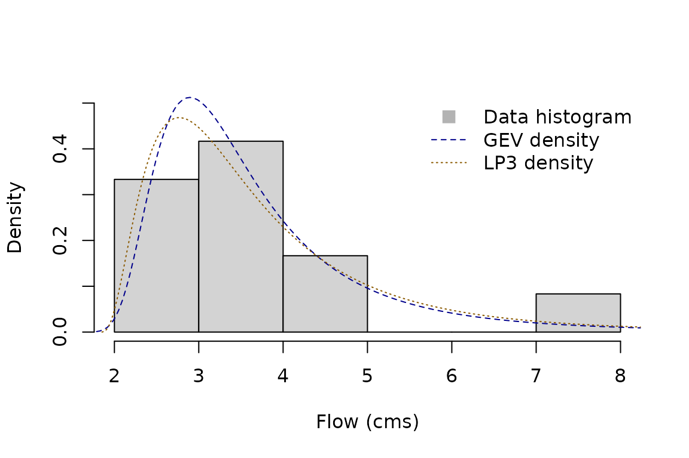
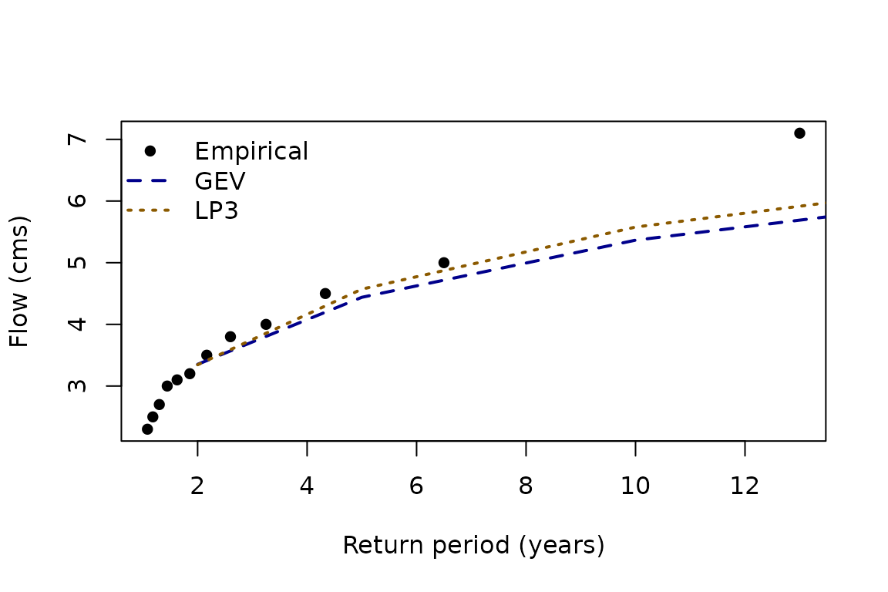

# Fitting Distribution Families with famish

`famish` works with distribution **families**—sets of related
distributions indexed by parameters—rather than single distributions.
For example, the Normal family is indexed by its mean and standard
deviation, while the Beta family is indexed by shape parameters
$`\alpha`$ and $`\beta`$. Once parameters are fixed, you have a specific
distribution inside the family.

`famish` aims to connects those families to data (or other targets such
as expert-elicited quantiles) using two ideas:

- **Fitting** narrows a family to a single distribution. This is the
  functionality provided today via
  [`fit_dst()`](https://famish.netlify.app/reference/fit_dst.md) and the
  `fit_dst_*()` wrappers.
- **Refining** narrows a family to a smaller sub-family that satisfies
  constraints. This capability is on the roadmap but not yet
  implemented.

Because fitting must return a single distribution, failure handling
matters. You control this via the `on_unres` argument: return a Null
distribution (default) or raise an error.

## A quick fitting workflow

Start by loading `famish` and the core probaverse package, `distionary`.
In practice, you will most likely just load the whole probaverse with
[`library(probaverse)`](https://probaverse.probaverse.com/) instead.

``` r

library(distionary)
library(famish)
```

Suppose we have annual streamflow maxima (cubic meters per second) for
12 years. We will fit two distributions from two different families.

``` r

x <- c(4.0, 2.7, 3.5, 3.2, 7.1, 3.1, 2.5, 5.0, 2.3, 4.5, 3.0, 3.8)
```

Fit a Generalised Extreme Value (GEV) distribution with
maximum-likelihood estimation using its wrapper:

``` r

gev <- fit_dst_gev(x)
#> Loading required namespace: testthat
gev
#> Generalised Extreme Value distribution (continuous) 
#> --Parameters--
#>  location     scale     shape 
#> 3.0658476 0.7426435 0.2699160
```

You can also call
[`fit_dst()`](https://famish.netlify.app/reference/fit_dst.md) directly
to use other combinations. Here we fit a Log Pearson Type III
distribution using L-moments on the log scale:

``` r

lp3 <- fit_dst("lp3", x, method = "lmom-log")
lp3
#> Log Pearson Type III distribution (continuous) 
#> --Parameters--
#>   meanlog     sdlog      skew 
#> 1.2652738 0.3382651 1.0430967
```

Both fits return `distionary` objects, so any downstream probaverse
tooling applies. Basic comparisons start with visual diagnostics:

``` r

hist(x, freq = FALSE, ylim = c(0, 0.5), main = NULL, xlab = "Flow (cms)")
plot(gev, "density", add = TRUE, n = 400, lty = 2, col = "blue4")
plot(lp3, "density", add = TRUE, n = 400, lty = 3, col = "orange4")
legend(
  "topright",
  legend = c("Data histogram", "GEV density", "LP3 density"),
  lty = c(NA, 2, 3),
  pch = c(15, NA, NA),
  col = c("gray70", "blue4", "orange4"),
  pt.cex = c(1.5, NA, NA),
  bty = "n"
)
```



## Diagnostics that emphasise extremes

Risk-focused work often requires tail checks. `famish` exposes empirical
ranking and quantile scores so you can benchmark fitted models.

Return levels at common periods (2-, 5-, 10-, 20-, 50-, 100-, 200-year)
provide one view:

``` r

quantiles <- enframe_return(
  gev, lp3,
  at = c(2, 5, 10, 20, 50, 100, 200),
  arg_name = "return_period",
  fn_prefix = "flow"
)
quantiles
#> # A tibble: 7 × 3
#>   return_period flow_gev flow_lp3
#>           <dbl>    <dbl>    <dbl>
#> 1             2     3.35     3.35
#> 2             5     4.44     4.57
#> 3            10     5.37     5.58
#> 4            20     6.45     6.70
#> 5            50     8.20     8.43
#> 6           100     9.84     9.95
#> 7           200    11.8     11.7
```

Plotting the empirical data against fitted curves highlights tail
behaviour.

``` r

x_return_periods <- rpscore(x, pos = "Weibull")

plot(
  sort(x_return_periods), sort(x),
  xlab = "Return period (years)",
  ylab = "Flow (cms)",
  pch = 16, col = "black"
)
lines(quantiles$return_period, quantiles$flow_gev, col = "blue4", lty = 2, lwd = 2)
lines(quantiles$return_period, quantiles$flow_lp3, col = "orange4", lty = 3, lwd = 2)
legend(
  "topleft",
  legend = c("Empirical", "GEV", "LP3"),
  col = c("black", "blue4", "orange4"),
  pch = c(16, NA, NA),
  lty = c(NA, 2, 3),
  lwd = 2,
  bty = "n"
)
```



Quantile scores provide a quantitative metric for how well a quantile is
estimated. Lower scores indicate better calibration at the specified
quantile level (Gneiting, 2011).

``` r

gev_100y <- quantiles$flow_gev[quantiles$return_period == 100]
lp3_100y <- quantiles$flow_lp3[quantiles$return_period == 100]

qs_gev <- quantile_score(x, gev_100y, tau = 1 - 1 / 100)
qs_lp3 <- quantile_score(x, lp3_100y, tau = 1 - 1 / 100)

c(GEV = mean(qs_gev), LP3 = mean(qs_lp3))
#>        GEV        LP3 
#> 0.06112929 0.06220155
```

## Supported methods and failure handling

[`fit_dst()`](https://famish.netlify.app/reference/fit_dst.md)
dispatches to different estimation routines:

- `lmom` and `lmom-log` use the `lmom` package (or internal
  implementations for simple families).
- `mle` uses `ismev` for the GEV, GP, and Gumbel families; otherwise it
  falls back to `fitdistrplus`.
- Other supported methods (`mge`, `mme`) are routed through
  `fitdistrplus`.

Wrappers such as
[`fit_dst_gev()`](https://famish.netlify.app/reference/fit_dst_family_wrappers.md)
or
[`fit_dst_norm()`](https://famish.netlify.app/reference/fit_dst_family_wrappers.md)
document the combinations that have been verified by extensive testing.
Unsupported combinations trigger a warning and still attempt fitting
through `fitdistrplus`.

Failure can happen when data are incompatible with a distribution (e.g.,
negative observations for an exponential fit) or when the combination is
not yet implemented. You can control the failure behaviour via:

- `na_action`: how missing values are handled (`"null"`, `"drop"`, or
  `"fail"`).
- `on_unres`: what to do when a distribution cannot be resolved
  (`"null"` or `"fail"`).

## Roadmap

Current development focuses on fitting. Future releases aim to:

- add “refining” tools that keep families but impose constraints (e.g.,
  matching moments),
- expose more control over underlying estimation routines,
- expand diagnostics tailored to extreme-value analysis.

## References

Gneiting, T. (2011). Making and evaluating point forecasts. *Journal of
the American Statistical Association*, 106(494), 746–762.
