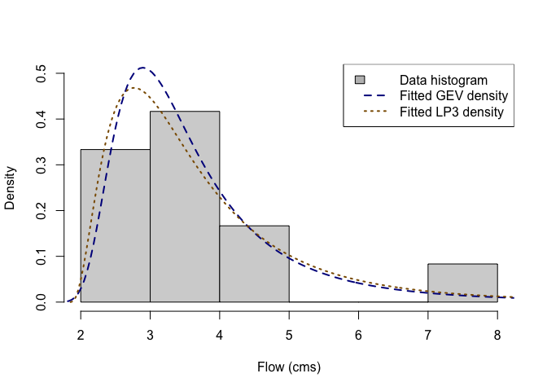
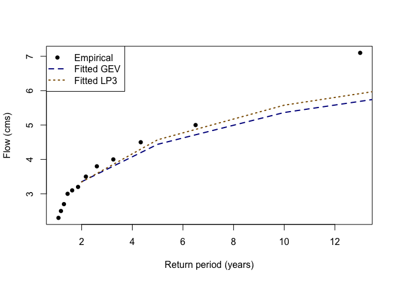

# famish

The goal of `famish` is to refine a **fam**ily of distributions to match
a provided dataset. In most use cases, this means fitting a distribution
to data, and this is the current version functionality of `famish`.
Importantly, `famish` grounds the broader [probaverse
suite](https://probaverse.com/) of packages to real data.

This young version of `famish` currently works mostly by wrapping
existing fitting functions from other packages, particularly
`fitdistrplus`, `ismev` and `lmom`. The main function is
[`fit_dst()`](https://famish.netlify.app/reference/fit_dst.md), which
fits a specified distribution family to data using a specified fitting
method. Thin wrappers for specific distribution families are also
provided, such as
[`fit_dst_gev()`](https://famish.netlify.app/reference/fit_dst_family_wrappers.md)
for the Generalised Extreme Value distribution.

The name “famish” reflects the process of narrowing down a broad family
of distributions to those that best fit your needs.

## Statement of Need

Many software routines allow for the estimation of probability
distributions, but there is a need to connect those estimates to the
downstream operations needed for advanced statistical models. The
probaverse supplies that higher-level infrastructure, and `famish` is
the bridge that grounds probaverse-built models in real datasets or
expert judgment.

## Target Audience

`famish` supports the probaverse user base – anyone who works with
probability distributions, including data scientists, analysts,
researchers, and students. It serves users who need flexible fitting
workflows and clear diagnostics for how well a distribution matches
observed data.

It is particularly useful for risk-focused domains – hydrology,
economics, actuarial science, credit risk, and similar fields – where
tail behaviour and extremes determine decisions and advanced
probabilistic models rely on dependable estimation tools.

## Installation

You can install the development version of famish from
[GitHub](https://github.com/) with:

``` r
# install.packages("remotes")
remotes::install_github("probaverse/famish")
```

## Future Goals

While the current version of `famish` is limited in scope, it has big
long-term goals, especially as the broader probaverse expands to allow
for the easier creation of distribution families. Some bigger goals for
`famish` include:

- Fitting cascades, such as first refining a family to have a specified
  mean (e.g., as estimated by regression), and then estimating the
  remaining parameters.
- Fitting a distribution to best match a supplied table of quantiles, or
  another reference distribution.
- Providing modern estimation methods that are more appropriate for
  estimation of risk and hazard analysis.

Additional features will be added as development continues. We
appreciate your patience and welcome contributions! Please see the
[contributing guide](https://famish.netlify.app/CONTRIBUTING.md) to get
started.

## Example: Fitting Distributions to Streamflow Data

In practice, you will most likely just load the whole probaverse with
[`library(probaverse)`](https://rdrr.io/r/base/library.html); but in
this minimal example, we’ll only load `famish`, and the core probaverse
package, `distionary`.

``` r
library(distionary)
library(famish)
```

To demonstrate, suppose we have 12 years of streamflow data for a small
stream, whose annual maxima (in cubic meters per second) are as follows:

``` r
x <- c(4.0, 2.7, 3.5, 3.2, 7.1, 3.1, 2.5, 5.0, 2.3, 4.5, 3.0, 3.8)
```

A common practice in hydrology is to fit a distribution to these data,
and to calculate upper quantiles.

Using the
[`fit_dst_gev()`](https://famish.netlify.app/reference/fit_dst_family_wrappers.md)
function, fit a Generalised Extreme Value (GEV) distribution, keeping
the default fitting method (maximum likelihood).

``` r
# Fit a GEV distribution using the default fitting method.
gev <- fit_dst_gev(x)
#> Loading required namespace: testthat
# Inspect:
gev
#> Generalised Extreme Value distribution (continuous) 
#> --Parameters--
#>  location     scale     shape 
#> 3.0658476 0.7426435 0.2699160
```

The fitted distribution is from the `distionary` package, which is the
core of the probaverse suite of packages. In fact, almost all
distribution families provided by `distionary` can be fit by `famish`;
to be sure, note that the `fit_dst_*()` wrappers are the definitive
source indicating which families and methods are supported.

Next, try fitting a Log Pearson Type III (LP3) distribution using the
method of L-moments, but on the log scale. This time, we’ll demonstrate
the use of the main
[`fit_dst()`](https://famish.netlify.app/reference/fit_dst.md) function
instead of the
[`fit_dst_lp3()`](https://famish.netlify.app/reference/fit_dst_family_wrappers.md)
wrapper.

``` r
# Fit a Log Pearson Type III distribution using "lmom-log" method.
lp3 <- fit_dst("lp3", x, method = "lmom-log")
# Inspect:
lp3
#> Log Pearson Type III distribution (continuous) 
#> --Parameters--
#>   meanlog     sdlog      skew 
#> 1.2652738 0.3382651 1.0430967
```

As a first pass at inspecting how well the models fit the data, we can
compare density plots to a data histogram.

``` r
# Plot a histogram of the data.
hist(x, freq = FALSE, ylim = c(0, 0.5), main = NULL, xlab = "Flow (cms)")
# Overlay the fitted densities.
plot(gev, "density", add = TRUE, n = 400, lty = 2, lwd = 2, col = "blue4")
plot(lp3, "density", add = TRUE, n = 400, lty = 3, lwd = 2, col = "orange4")
# Create a legend.
legend(
  "topright",
  legend = c("Data histogram", "Fitted GEV density", "Fitted LP3 density"),
  fill = c("gray", NA, NA),
  lty = c(NA, 2, 3),
  lwd = 2,
  border = c("black", NA, NA),
  col = c(NA, "blue4", "orange4")
)
```



Upper quantiles are useful for estimating the magnitude of rare events.
These can be calculated using the
[`distionary::enframe_return()`](https://distionary.probaverse.com/reference/return.html)
function. In this case, we’ll calculate the 2-, 5-, 10-, 20-, 50-, 100-
and 200-year return levels for each fitted distribution.

``` r
# Calculate return levels for each model.
quantiles <- enframe_return(
  gev, lp3,
  at = c(2, 5, 10, 20, 50, 100, 200),
  arg_name = "return_period",
  fn_prefix = "flow"
)
# Inspect:
quantiles
#> # A tibble: 7 × 3
#>   return_period flow_gev flow_lp3
#>           <dbl>    <dbl>    <dbl>
#> 1             2     3.35     3.35
#> 2             5     4.44     4.57
#> 3            10     5.37     5.58
#> 4            20     6.45     6.70
#> 5            50     8.20     8.43
#> 6           100     9.84     9.95
#> 7           200    11.8     11.7
```

We can also calculate empirical return periods associated with the
observed data with the
[`rpscore()`](https://famish.netlify.app/reference/scores.md) function.
In this case, use the Weibull plotting position, and compare the
empirical return periods to the data.

``` r
# Calculate empirical return periods.
x_return_periods <- rpscore(x, pos = "Weibull")
# Inspect in a data frame along with the data.
data.frame(
  return_period = sort(x_return_periods),
  flow_empirical = sort(x)
)
#>    return_period flow_empirical
#> 1       1.083333            2.3
#> 2       1.181818            2.5
#> 3       1.300000            2.7
#> 4       1.444444            3.0
#> 5       1.625000            3.1
#> 6       1.857143            3.2
#> 7       2.166667            3.5
#> 8       2.600000            3.8
#> 9       3.250000            4.0
#> 10      4.333333            4.5
#> 11      6.500000            5.0
#> 12     13.000000            7.1
```

These three sets of return levels can be plotted together to visually
assess the fit of the two distributions’ upper tails, as an alternative
to the histogram view.

``` r
# Plot the empirical frequency-magnitude plot.
plot(
  x_return_periods, x, 
  # log = "x",
  xlab = "Return period (years)",
  ylab = "Flow (cms)",
  pch = 16, col = "black"
)
# Plot the fitted distributions' frequency-magnitude plots.
lines(
  quantiles$return_period, quantiles$flow_gev,
  col = "blue4",
  lty = 2,
  lwd = 2
)
lines(
  quantiles$return_period, quantiles$flow_lp3,
  col = "orange4",
  lty = 3,
  lwd = 2
)
# Add a legend
legend(
  "topleft",
  legend = c(
    "Empirical",
    "Fitted GEV",
    "Fitted LP3"
  ),
  col = c("black", "blue4", "orange4"),
  pch = c(16, NA, NA),
  lty = c(NA, 2, 3),
  lwd = 2
)
```



The ‘famish’ package also provides support for calculating the quantile
score. Now calculate the mean quantile score for the 100-year event,
recalling that the quantile level (non-exceedance probability of the
event) is `tau = 1 - 1 / return_period`.

``` r
## First get the 100-year quantiles for each model.
gev_100y <- quantiles$flow_gev[quantiles$return_period == 100]
lp3_100y <- quantiles$flow_lp3[quantiles$return_period == 100]
## Calculate the mean quantile score for the 100-year event, GEV model.
qs_gev <- quantile_score(x, gev_100y, tau = 1 - 1 / 100)
## Inspect
mean(qs_gev)
#> [1] 0.06112929
```

``` r
## Calculate the mean quantile score for the 100-year event, LP3 model.
qs_lp3 <- quantile_score(x, lp3_100y, tau = 1 - 1 / 100)
## Inspect
mean(qs_lp3)
#> [1] 0.06220155
```

Lower quantile scores suggest a better fit, meaning that the GEV may be
better. For a mroe robust decision based on the quantile score, consider
using bootstrap to estimate the uncertainty associated with this
measurement.

## Correctness and Reliability

For those combinations of distribution families and fitting methods
indicated by the functions `fit_dst_*()`, rigorous testing has been
conducted to ensure that the estimation methods are consistent – that
is, the estimated distribution parameters converge to the true parameter
values as more data are drawn from the distribution being estimated.

## `famish` in the Context of Other Packages

`famish` is unique as it is a bridge from existing fitting routines to
the probaverse suite of packages.

- Packages `lmom`, `ismev`, and `fitdistrplus` are all useful for
  fitting distribution parameters (and are in fact wrapped by `famish`),
  but remain low-level.
- Packages like `distributions3` and `distributional` turn distributions
  in objects, but lack estimation capabilities.

## Acknowledgements

The creation of `famish` would not have been possible without the
support of BGC Engineering Inc., the Politecnico di Milano, and the
European Space Agency.

## Citation

To cite package `famish` in publications use:

Coia V (2025). *famish: Flexibly Tune Probability Distributions*. R
package version 0.2.0, <https://github.com/probaverse/famish>,
<https://famish.probaverse.com/>.

## Code of Conduct

Please note that the `famish` project is released with a [Code of
Conduct](https://distplyr.probaverse.com/CODE_OF_CONDUCT.html). By
contributing to this project, you agree to abide by its terms.
